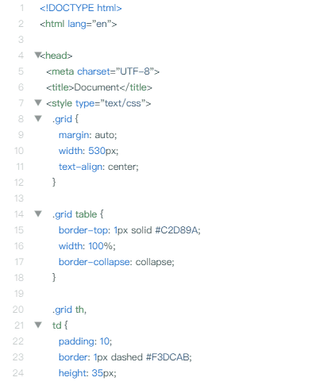
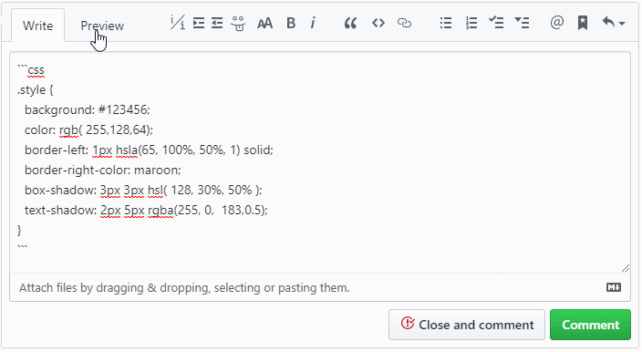
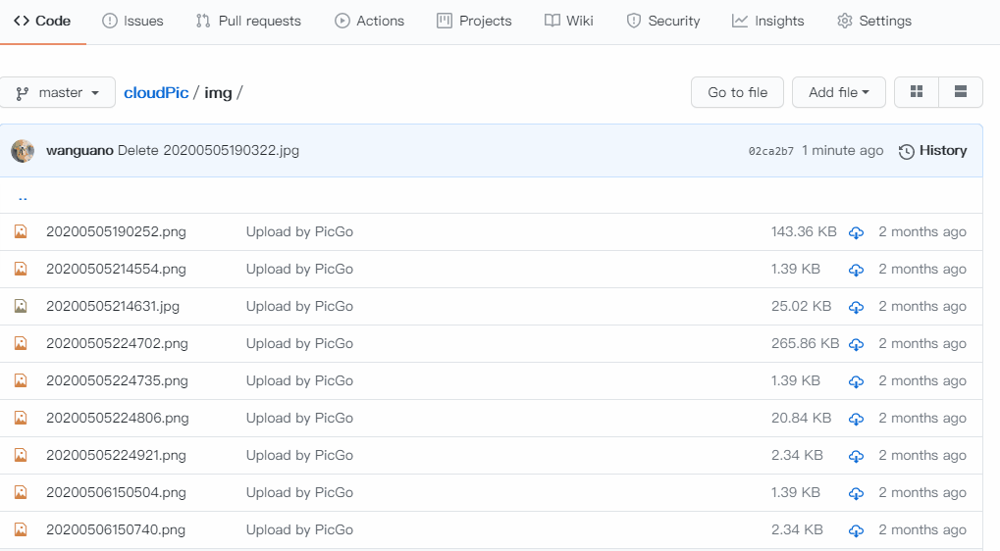
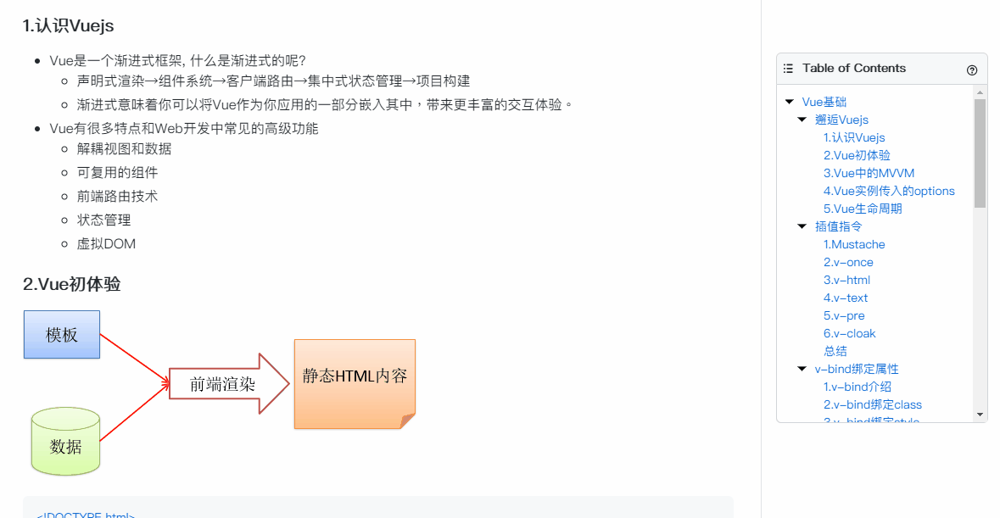
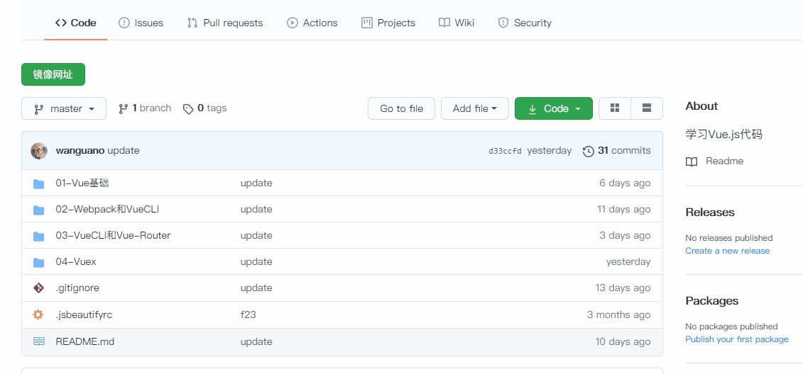
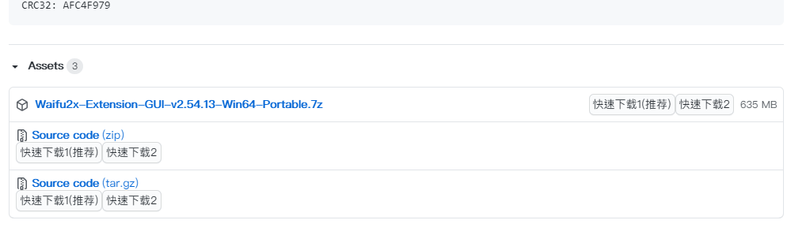
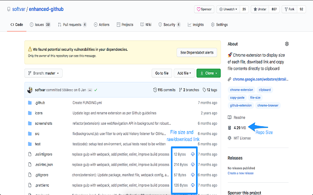
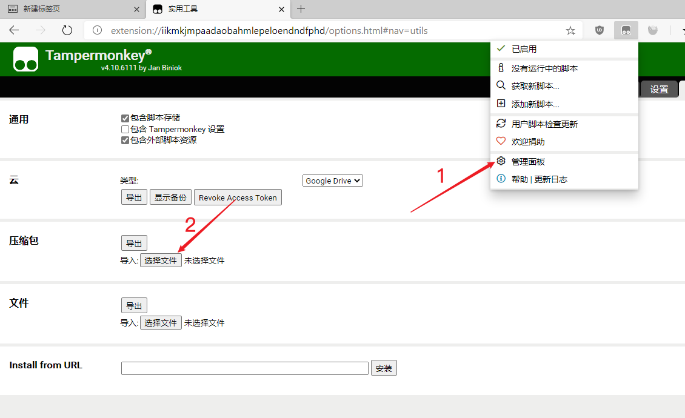

# 玩转Github【效率提升200%】

[toc]

> 阅读本文将会助你高效浏览 Github (**多张效果图**)，推荐的 **插件** 和 **脚本**  会助你提高生产力 

## 阅读前言

> 你的浏览器需要有 [Tampermonkey](https://chrome.google.com/webstore/detail/tampermonkey/dhdgffkkebhmkfjojejmpbldmpobfkfo?utm_source=chrome-ntp-icon) 插件, 作用是可以将`JavaScript`嵌入任何页面, 更好的浏览网页
>
> 也可以选择在最新版 Edge 浏览器安装 Tampermonkey 插件
>
> **推荐的脚本和插件效果全部图片展示，安装脚本在最后一章**

## 脚本篇 

### 1.代码折叠脚本【GitHub Code Folding】

使用场景：当你在 Github 中浏览源码中，可以非常高效的折叠代码，什么类型代码都可以折叠

### 2.显示代码颜色【GitHub code colors】

使用场景：在**代码颜色旁边添加颜色样式**的脚本

- 它适用于注释预览和代码页

### 3.复制代码段【copy code snippet】

使用场景：需要复制代码块时会方便很多，不需要全部选中一键复制代码块 

- 将鼠标悬停在代码段上，从而将副本添加到剪贴板按钮

### 4.GitHub图像预览【 image preview】

使用场景： 需要预览仓库中的图像，不需要点击去查看，直接预览图片

- 该脚本增加了预览图像（png，jpg，jpeg，gif，tif，tiff，bmp，webp和svg）

### 5.Github目录导航【able of contents】

使用场景：当你进入一个仓库时会将标题目录，添加到页面中，方便锚点跳转

- 当进入仓库时，会自动添加一个**可拖动**的弹出窗口。创建TOC之前，至少必须有**三个锚点**

- 键盘命令：
  - 按下Esc以“隐藏”目录右上角的目录。
  - 彼此之间在一秒钟之内按g+ t，以切换目录视图。
  - 彼此之间在一秒钟之内按g+ r，以重置TOC位置。

### 6.Github镜像访问和加速下载

使用场景：克隆仓库均速800K 和 下载Releases时速度非常快均速4M 

- **优化了脚本默认不展开镜像网站，并且将最新版 Github 网站头部居中了**

## 插件篇

> 知道很多人安装了，所以放到了后面，这里推荐三个常用的插件, 这里就只提供插件的安装地址

### 1.Octotree

- 下载地址：[Octotree](https://chrome.google.com/webstore/detail/octotree/bkhaagjahfmjljalopjnoealnfndnagc?utm_source=chrome-ntp-icon)
- 使用场景： 增强GitHub代码的检查和探索，这个插件很多人都知道就不详细说了

### 2.Enhanced GitHub 增强浏览gihub

- 下载地址： [Enhanced GitHub](https://chrome.google.com/webstore/detail/enhanced-github/anlikcnbgdeidpacdbdljnabclhahhmd?utm_source=chrome-ntp-icon)
- 使用场景： 显示仓库大小，每个文件的大小，下载链接和复制文件内容的选项

### 3.github-file-icon 显示仓库文件图标

- 下载地址：[github-file-icon](https://chrome.google.com/webstore/detail/file-icon-for-github-and/ficfmibkjjnpogdcfhfokmihanoldbfe?utm_source=chrome-ntp-icon)
- 特定于文件类型的图标替换原始文件图标。这改善了GitHub，GitLab等上的视觉识别能力

## 脚本安装篇

前提记得安装 [Tampermonkey](https://chrome.google.com/webstore/detail/tampermonkey/dhdgffkkebhmkfjojejmpbldmpobfkfo?utm_source=chrome-ntp-icon)  这个插件

### 下载脚本

- 我已经把介绍的脚本全部放在**蓝奏云**了： [全部脚本](https://wwa.lanzous.com/iWjJseojp8f)

- 已经看到这的小伙伴点个start👍，再走呗😉

### 导入脚本

